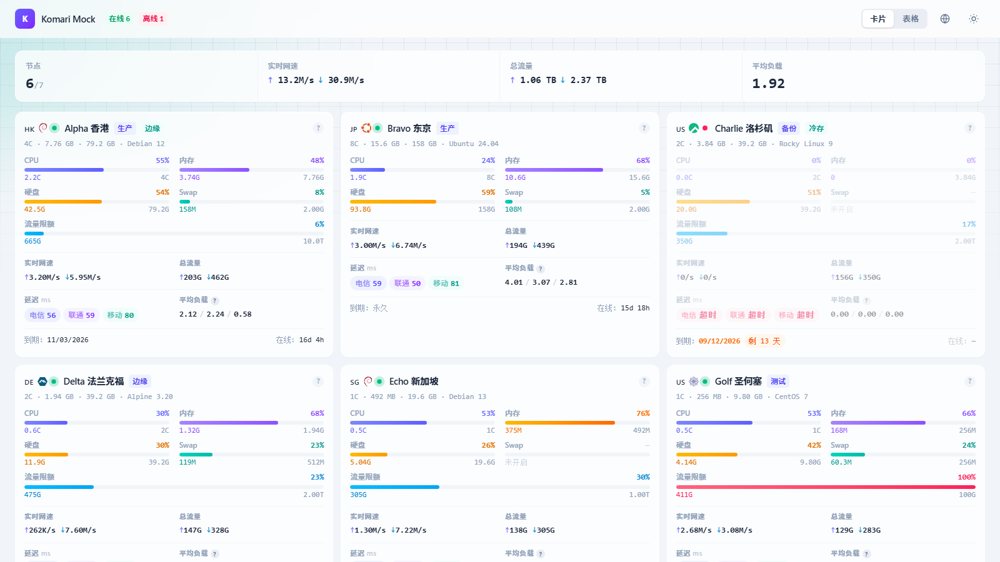

# Komari Theme Minimal

单色极简风格的 [Komari Monitor](https://github.com/komari-monitor/komari) 第三方主题。网格与表格双视图，外观跟随系统，简体中文 / 繁體中文 / English 三语。



## 特性

- **双视图**：网格卡片与紧凑表格，访客的选择记在本地
- **卡片信息密度**：CPU、内存、交换、磁盘、负载、流量配额、三网延迟一屏看完
- **详情页六图**：CPU / 内存与交换 / 磁盘 / 网速 / 平均负载 / 延迟，uPlot 绘制，带十字准线浮层
- **分组筛选**：按 Komari 里配置的节点分组过滤，选择持久化
- **身份入口**：已登录显示后台入口，访客显示登录入口
- **首屏骨架屏**：数据到达前不留白屏
- **零外部请求**：国旗与系统图标全部自托管，不向任何第三方 CDN 发请求（否则每个访客的 IP 都会泄漏给第三方，内网部署也会直接失效）

## 安装

### 主题市场

后台 → 主题 → 主题市场，找到 Minimal，点安装。

### 手动上传

从 [Releases](https://github.com/lizhenmiao/komari-theme-minimal/releases) 下载 `komari-theme-minimal-<版本>.zip`，在后台 → 主题 → 上传主题里选中它。

## 主题设置

安装后在后台 → 主题 → **Minimal 设置** 里配置。

| 键 | 类型 | 默认 | 说明 |
| --- | --- | --- | --- |
| `defaultView` | 选择 | `grid` | 首页初始视图。访客切换后以其本地选择为准 |
| `refreshInterval` | 数字 | `2` | 实时数据轮询间隔（秒）。标签页隐藏时自动暂停 |
| `showDisk` | 开关 | 开 | 卡片显示磁盘 |
| `showLoad` | 开关 | 开 | 卡片显示负载 |
| `showSparkline` | 开关 | 开 | 每张卡片一条 CPU 趋势线 |
| `showTraffic` | 开关 | 开 | 按节点的 `traffic_limit_type` 计算流量配额 |
| `showExpiry` | 开关 | 开 | 显示到期时间 |
| `showPrice` | 开关 | **关** | 显示价格 |
| `showPing` | 开关 | 开 | 显示延迟与丢包 |
| `featuredPingTasks` | 探测任务 | 空 | 选 2-3 个在卡片上并排显示，留空则只在详情页展示 |
| `historyHours` | 数字 | `4` | 详情页图表默认时间范围 |
| `maxPoints` | 数字 | `500` | 每图最大点数，由服务端降采样 |
| `featuredNodes` | 节点 | 空 | 置顶节点，其余按权重升序 |
| `footerHtml` | 富文本 | 空 | 追加在页脚版权行之后 |

> [!WARNING]
> 主题设置通过**未鉴权、任何访客都能读**的 `GET /api/public` 下发。任何 token、密钥、私有地址都不要填进来。`showPrice` 默认关闭正是因为价格对所有访客可见。

## 本地开发

需要 Node 22。Vite 6 声明支持的范围是 `^18 || ^20 || >=22`，21 / 23 这类奇数版本不在其中；CI 用的是 22。

```bash
git clone https://github.com/lizhenmiao/komari-theme-minimal.git
cd komari-theme-minimal
npm install
```

有两种开发方式，各自解决不同的问题。

### 一、假服务端：不需要真实实例

```bash
npm run build
npm run mock          # http://127.0.0.1:4928
```

假服务端按真实接口形状返回固定数据，含 1 个离线节点、1 个已到期节点、若干分组，以及一个**没有配置任何探测任务**的节点。几个开关用来验证降级路径：

| 参数 | 作用 |
| --- | --- |
| `--no-rpc2` | 关掉 `/api/rpc2`，逼主题退回 REST 轮询 |
| `--no-metrics` | 关掉 `queryMetrics`，逼主题退回 `getRecords` |
| `--guest` | 切成未登录访客，用来验证后台入口确实被隐藏 |
| 任意数字 | 指定端口，默认 `4928`；传 `0` 让系统分配空闲端口 |

传参数时 `--` 不能省：

```bash
npm run mock -- --no-rpc2          # 对
npm run mock --no-rpc2             # 错，npm 把它当自己的配置吞掉，实际跑的是不带开关的版本
node scripts/mock-server.mjs --no-rpc2   # 也对，绕开 npm
```

假服务端只喂数据，页面用的是 `dist/` 里的产物 —— 改了代码要重新 `npm run build`。

### 二、代理到真实实例：带热更新

```bash
cp .env.example .env.local     # 填 VITE_API_TARGET
npm run dev                    # http://localhost:5273
```

dev server 把 `/api` 与 `/themes` 代理到 `VITE_API_TARGET`（`/api` 上开了 WebSocket 代理，rpc2 走的就是它），并**改写 `Origin` 与 `Referer`**。Komari 开启 CORS 时会校验 `Origin`，Vite 的 `changeOrigin` 只改 `Host` 头，浏览器发出的 `Origin` 仍是 `http://localhost:5273`，与实例的 `Host` 不符也不在白名单里，结果 `/api/*` 全部 403。改写之后不必去实例后台加白名单。

开发时直接访问 `http://localhost:5273/`，路径与线上完全一致（`/`、`/instance/xxx`）。**不要**在地址栏里带 `/themes/minimal/dist/` 前缀 —— 那只是构建产物里的资源前缀，带上去会让客户端路由匹配不到任何页面。

## 校验

```bash
npm test              # format:check + smoke + render ×3 + dev:check
npm run browser       # 构建后用真实 Chrome / Edge 跑一遍
npm run package       # 构建 + 契约校验 + 打包 + 归档校验
```

分层是刻意的，每层抓的是上一层看不见的东西：

| 命令 | 抓什么 |
| --- | --- |
| `format:check` | 纯函数边界：长期到期日、`0001` 年、非法输入、探测任务适用性。这些分支 DOM 层看不见 |
| `smoke` | 接口契约：字段形状、返回包装、降级路径。抓「HTTP 200、控制台干净、页面空的」那一类 |
| `render` | 在 Node 里挂真实组件树做 SSR。抓「构建干净、页面空白」和快照引用不稳定（React #185） |
| `dev:check` | 真实 dev server 的 base 与代理。抓详情页在开发态打不开那类问题 |
| `browser` | 真实浏览器：国旗解码、排序、uPlot 挂载、筛选交互、身份入口、页脚外链 |
| `package` | 归档契约：`komari-theme.json` 位置、`index.html` 四个哨兵、路径分隔符 |

另有 `node scripts/preview.mjs [--detail]` 用无头浏览器重拍 `preview.png`。

## 打包

```bash
npm run package
```

产出 `komari-theme-minimal-<版本>.zip`，结构必须是：

```
komari-theme-minimal-<版本>.zip
├── komari-theme.json      ← 归档根，与 dist/ 同级
├── preview.png
└── dist/
    ├── index.html
    └── assets/…
```

把 `komari-theme.json` 放进 `dist/` 是最常见的安装失败原因。

## 发布

```bash
npm run bump 0.2.0            # 改 manifest、提交、打标签，一步完成
git push origin HEAD v0.2.0   # 推送触发发布工作流
```

`npm run bump` 会拒绝在工作区不干净时执行（否则版本变更会和无关改动混在同一个 commit 里），也会拒绝重复的标签。它**不推送** —— 推标签等于真的发一个版本出去，这一步必须显式。

推送后 GitHub Actions 跑完整校验、打包、建 Release，并在说明里给出归档的 SHA256。

版本号不是固定的，但**标签必须与 `komari-theme.json` 的 `version` 相等**，工作流第一步就卡这个。归档名由 manifest 派生（`scripts/package.mjs`），两者不一致就会发出一个名字和版本号互相矛盾的包。`npm run bump` 存在的意义就是让这两者不可能对不上。预发布版本把两边都写成 `0.2.0-rc1` 即可。

### 收录进官方主题市场

只需要做一次。在 [`komari-monitor/theme-market`](https://github.com/komari-monitor/theme-market/issues/new/choose) 开 Issue，选「提交在 GitHub 中开源的主题」，填两项：

| 表单字段 | 填什么 |
| --- | --- |
| GitHub 仓库地址 | 本仓库地址 |
| 预览图链接 | `https://raw.githubusercontent.com/<owner>/<repo>/<默认分支>/preview.png` |

**不是提 PR，也不需要手填 version / sha256 / download** —— 目录只存元数据，主题包仍由作者自己托管，那些字段由市场的 Action 从最新 Release 推导。

预览图地址要指向**分支**而不是标签：目录里每个主题只有一条记录，自动更新只改 version / download / sha256，不改 preview。钉在某个标签上会把预览图永久冻在那一版。

收录之后无需再管：市场每六小时检查一次本仓库的最新 Release，校验根 manifest、`short`、版本与 SHA-256 通过后自动开更新 PR。所以后续发版只要 `npm run bump` + 推标签。

提交前确认三件事：

- 仓库公开，且最新 Release 里有可下载的归档
- 归档根有 `komari-theme.json`（`npm run package` 里的 `zip-check` 会验）
- `short` 在目录里唯一，且不是 `default`

### 发布失败后重试

跑到建 Release 那步之后才失败的话，同名 Release 已存在，重推标签会失败。先清掉再来：

```bash
gh release delete v0.2.0 --yes
git push origin :refs/tags/v0.2.0 && git tag -d v0.2.0
```

## 装载契约

Komari 加载主题时有几条硬约束，改构建配置前先看这里（依据在 `web/public/public.go`）：

- **资源前缀必须是 `/themes/minimal/dist/` 绝对路径。** 用 `./` 在 `/instance/xxx` 这类深层路由上会解析成 `/instance/assets/…`，服务端 `noRoute` 把 `index.html` 返回给它，浏览器按 MIME 拒绝执行，整页白屏。
- **资源与页面走两条完全不同的路径。** 资源走 `/themes/:id/*path`，纯静态查找，未命中直接 404、没有 SPA 兜底；页面走 `noRoute` 返回 `dist/index.html`，请求的是站点根下的路径。所以客户端路由不设 `basename`。
- **不能压缩 `index.html`。** Komari 用首次字符串匹配替换四个哨兵：`<title>Komari Monitor</title>`、`A simple server monitor tool.`、`</head>`、`</body>`。压缩或重排都会让注入静默失效。`index.html` 还必须是纯 ASCII 且无 BOM。
- **chunk 文件名不能以 `_` 开头。** Go 的 `embed` 会静默跳过这类文件，装到服务端后 404，而本地 `vite preview` 一切正常。
- **主题不能声明 `/admin` 与 `/terminal` 路由**，那两个是 Komari 内置 UI。链接过去没问题（本主题就是这么做的），但不能自己实现。
- **页脚必须保留 `Powered by Komari Monitor.`**

## 目录结构

```
src/
├── components/       展示组件，无数据获取
├── hooks/            连接 store 与组件的 useSyncExternalStore 读取层
├── i18n/             i18next 初始化与三份词条
├── lib/
│   ├── transport.ts  能力探测、轮询循环、REST 降级；含 StrictMode 双调用防护
│   ├── rpc.ts        /api/rpc2 的 JSON-RPC 客户端，WebSocket 优先、HTTP 兜底
│   ├── store.ts      外部 store，按节点粒度订阅，快照引用必须稳定
│   ├── normalize.ts  两种非规范状态结构 → NodeStatus
│   ├── metrics.ts    queryMetrics 的点分键名与单位换算
│   ├── theme-meta.ts 从 komari-theme.json 读主题名与仓库地址
│   └── …
└── pages/            Index（首页）与 NodeDetail（详情页）

scripts/              各层校验、假服务端、打包、图标抓取
```

## 许可

[MIT](./LICENSE)
